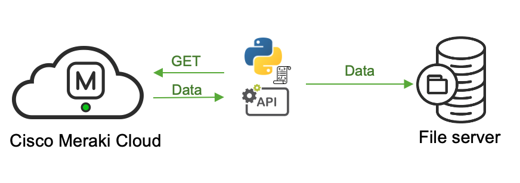

# Cisco Meraki Event Log exporter.

## Objective

***What does the script do?***

This script exports the Event Logs for a specific network and stores them on-premise.
This might be useful when there is a requirement to store the logs for a long period of time. 

***How does the script do it?***

The script creates a folder structure which is corresponding to the product types on the network.
Then, the script imports the event logs into respective folders.



## Installation

1. Clone the repository
```console
git clone https://github.com/SalnikovAndrey/meraki-event-log-exporter
```
2. Navigate into directory
```console
cd meraki-event-log-exporter
```
3. Create the virtual environment
```console
python3 -m venv venv
```
4. Start the virtual environment
```console
source venv/bin/activate
```
5. Install requirements.txt
```console
pip install -r requirements.txt 
```

## Usage

Script input:

1. parent_directory = Directory where you are going to store the logs,
2. organisation_id = Your Organisation ID
3. network_id = Your Network ID
4. starting_date = Please, stick to the format similar to the default
5. api_key_file = Create api_key.txt file and store your API key there, specify the full path to this file

Organisation and Network ID can be found by using the following URLs:

	- Get your OrganisationID:
	https://dashboard.meraki.com/api/v0/organizations
	- Get your NetworkID:
	https://dashboard.meraki.com/api/v0/organizations/{OrganisationID}/networks
	
Run the script:
```console
python3 event_log.py
```

Important note:
- Supported on Linux/Unix systems,
- The script is using file names to determine the latest imported timestamp, please do not modify/move files inside the folders.


